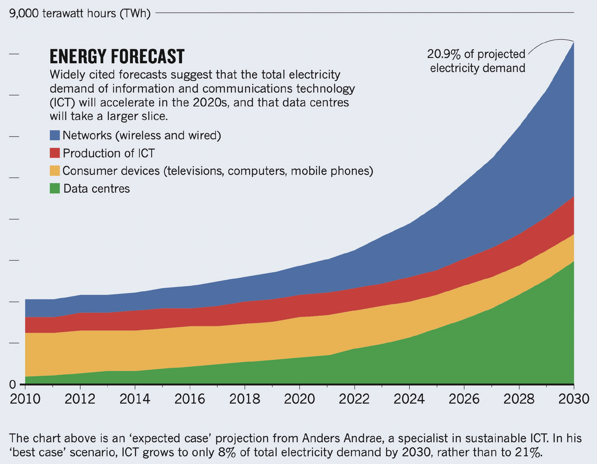

<!-- .slide: data-state="title" -->

# Module 1

===

<!-- .slide: data-state="standard" -->

## Increasing carbon footprint of computing and ICT

As researchers, we are not always aware of the cost and energy
requirements (thus CO2 eq.) of the compute we use daily.

Note:

Add notes to the presenter...

===

<!-- .slide: data-state="standard" -->

Computing carbon footprint can be split is two main
contribution:
 - manufactoring
 - usage

## Manufacturing and amortizing
Life-cycle footprint

## Usage
Powering, memory

Note:

Add notes to the presenter...

===

<!-- .slide: data-state="standard" -->

## Typical values of energy

| Energy (J) | Examples | Equ. gCO2 |
| :-------- | -------: |--------:|
| 1.0e0 | Lift an apple to your mouth | |
| 1.0e1 |  | |
| 1.0e2 |  | |
| 1.0e3 (kJ) | Standby LED (0.3W) for 1 hour | |
| 1.0e4 | LED-based lightbulb (3W) for 1 hour | |
| 1.0e5 | 15 mn bike ride | |
| 1.0e6 (MJ) | ~ 2km drive | |
| 3.6e6 (1 kWh)|  | 305 |
| 1.0e7 | Human energy need per day | |
| 1.0e8 | Averaged daily cons. of NL home | |
| 1.0e9 (0.27 MWh) | Round trip flight AMS-LON for 2 | |

Note:

Add notes to the presenter...

===

<!-- .slide: data-state="standard" -->

## Power consumption of computing hardware

CPU power over years: increase
GPU power over years: increase

Scaling by Flops
- Modern CPU are drawing more power, but getting more flops/W
- GPU introduce a further jump in flops/W

Example of Snellius: same amount of flops for 1/5 of the power (Ben slides)

Note:

Add notes to the presenter...

===

<!-- .slide: data-state="standard" -->

## Cluster/server energy usage

Static power draw:
 - memory
 - network card
 - CPU leakage current ~ # of cores
is not proportional to compute.
Once the server is built and in use, maximizing occupancy
increase the power efficiency as static power draw is
amortized.

Note:

Add notes to the presenter...

===

## CPU energy usage

CPU increased clock rate to squeeze more Flops out.
Initialy amortizes the leakage current, so more
energy efficient.

As clockrate increase, power increase too but not at
a linear rate because the voltage in the circuit needs to
be increased too in order to send signal faster.
Power ~ P_0 + k * V^2 * f_c (sort of)

Note:

Add notes to the presenter...

===

<!-- .slide: data-state="standard" -->

## PUE of datacenter

Modern data centers only need about 10% extra power
for cooling and such on top of the compute required power.

PUE = P_{total} / P_{compute}

Note:

Add notes to the presenter...

===

<!-- .slide: data-state="standard" -->

## Energy carbon intensity

Carbon intensity has a large spatial and temporal variability.

Note:

Add notes to the presenter...

===

<!-- .slide: data-state="standard" -->

## Title of the first 

Note:

Add notes to the presenter...

===
<!-- .slide: data-state="standard" -->

## Title of the first 

Note:

Add notes to the presenter...

===
<!-- .slide: data-state="standard" -->

## Title of the first 

Note:

Add notes to the presenter...

===

<!-- .slide: data-state="keepintouch" -->

www.esciencecenter.nl

info@esciencecenter.nl

020 - 460 47 70
