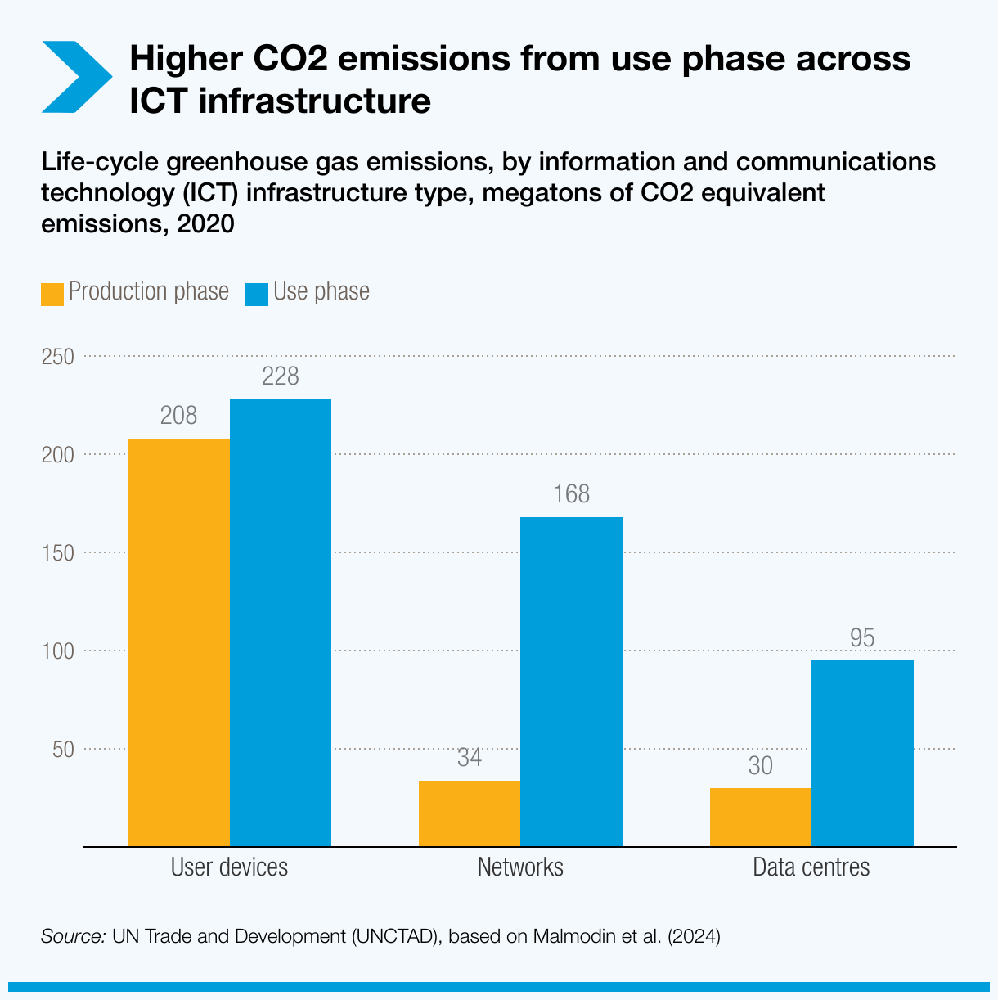
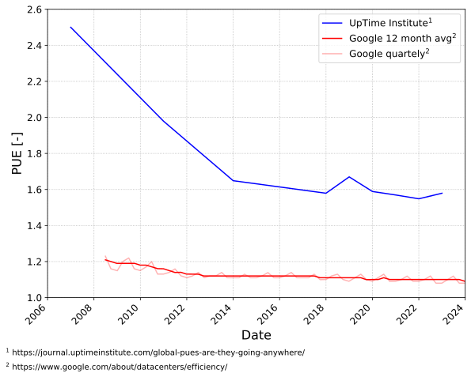
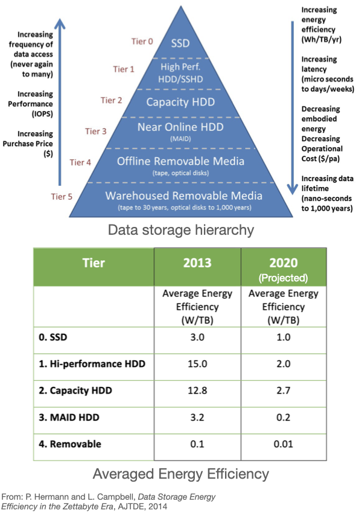
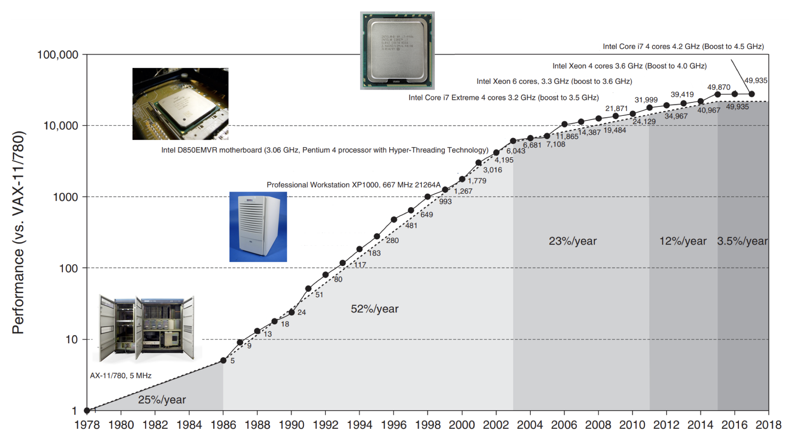
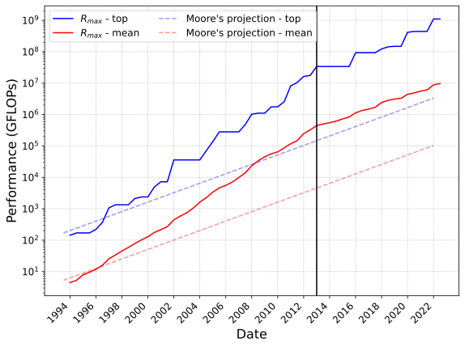
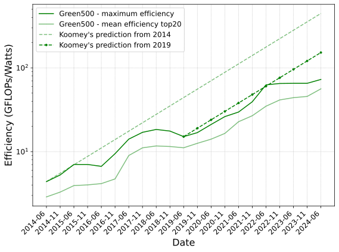

<!-- .slide: data-state="title" -->

# Energy in Computing

===

<!-- .slide: data-state="standard" -->
### We will try to answer
- _How much energy is a lot of energy?_
- _Does Information Computing Technology use a lot of energy?_
- _Where is the energy going?_

===

<!-- .slide: data-state="standard" data-background-gradient="radial-gradient(rgb(230, 200, 255), rgb(255, 255, 255))" -->

### _How much energy is a lot of energy?_

===

<!-- .slide: data-state="standard" -->

## Typical values of energy

| Energy (J) | Examples | Equ. gCO$_2$ |
| :-------- | -------: |--------:|
| 1.0e0 | ??????????????????????????????????? | |
| 1.0e1 | ??????????????????????????????????? | |
| 1.0e2 | ??????????????????????????????????? | |
| 1.0e3 (kJ) | ??????????????????????????????????? | |
| 1.0e4 | ??????????????????????????????????? | |
| 1.0e5 | ??????????????????????????????????? | |
| 1.0e6 (MJ) | ??????????????????????????????????? | |
| 3.6e6 (1 kWh)| ??????????????????????????????????? | 305 |
| 1.0e7 | ??????????????????????????????????? | |
| 1.0e8 | ??????????????????????????????????? | |
| 1.0e9 (0.27 MWh) | ??????????????????????????????????? | | |

Note:

Do you have a feel for how much 1 Joule actually is?
Press down arrow to see the examples for different orders of magnitude.

==

## Typical values of energy

| Energy (J) | Examples | Equ. gCO$_2$ |
| :-------- | -------: |--------:|
| 1.0e0 | Lift an apple to your mouth | |
| 1.0e1 | Tennis ball kin. energy at 220 km/h  | |
| 1.0e2 |  | |
| 1.0e3 (kJ) | Standby LED (0.3W) for 1 hour | |
| 1.0e4 | LED-based lightbulb (3W) for 1 hour | |
| 1.0e5 | 15 mn bike ride | |
| 1.0e6 (MJ) | ~ 2km drive | |
| 3.6e6 (1 kWh)| Bring 10L of water to boil | 305 |
| 1.0e7 | Human energy need per day | |
| 1.0e8 | Average daily cons. of 3 NL homes | |
| 1.0e9 (0.27 MWh) | Round trip flight AMS-LON for 2 | |

===

<!-- .slide: data-state="standard" data-background-gradient="radial-gradient(rgb(230, 200, 255), rgb(255, 255, 255))" -->

### _Does Information Computing Technology use a lot of energy?_

===

<!-- .slide: data-state="standard" -->

### ICT uses a lot of energy

* Information Computing Technology (ICT) 
* Predicted major increase in electricity demand:
- from 8% to 21% in 2030.

* Responsible for about 2% of global CO$_2$ emmisions, on par with the aviation sector.

Note:

On the graph:
 - 4 components to ICT demand: network infra., consumer device (not including IoT-connected devices), data center and production from first three components (cradle-to-gate)
 - this is an expected prediction, best and worst case scenario are 12% and 50%, resp.

As researchers we use devices (laptops, workstations), local/national clusters (e.g. Snellius) and cloud services (SURF Cloud, AWS, ...).
Our day2day work embedded in ICT.

===

<!-- .slide: data-state="standard" -->

### Overall contribution of ICT

- Computing carbon footprint can be split into two main contributions:
  - *Embodied*: from raw material extraction, to distribution
  - *Usage*: Powering, memory, infrastructure

Note:

===

<!-- .slide: data-state="standard" -->

### _Does optimizing matter?_

* Most CO$_2$ comes from the usage of data centers not the building of them
* Reducing your energy while running software indeed matters.

Note:

Here is something that adds to the story of “optimization of energy”: This CO$_2$ footprint of use phase vs production phase shows that most of the CO$_2$ comes from the usage of data centers not the building of them. So reducing your energy while running software indeed matters.

===

<!-- .slide: data-state="standard" -->

### Data centers

* Compute and/or storage
* Efficiency characterized by Power Usage Effectiveness (PUE)
 `$$ PUE = P_{total} / P_{IT} $$`
* Quantifies overhead. Gives you e.g. how much cooling power you need per unit of compute
* Best data centers are now down to about 10% extra for cooling, but still large variability. Used to be around 100%.

Note:
 - $P_{IT}$ in PUE not limited to CPU/GPU, also include network, memory storage, backups, ...

===

<!-- .slide: data-state="standard" data-background-gradient="radial-gradient(rgb(230, 200, 255), rgb(255, 255, 255))" -->

### _Where is the energy going?_

===

<!-- .slide: data-state="standard" -->

### Data storage

* Different type of storage for different usages: latency, volume, ...
* Very different energy consumption depending on state: idle, reading, writing
* Storage efficiency (W/TB) strongly tied to technological solution
* Storage efficiency has decreased over the years

Note: 

 - Not a widely used ranking of storage technologies, but indicative of each Tier plus/minuses
 - Lower table shows efficiency projection from 2013 to 2020. Figures assume a data center equiped
with only a given Tier of storage

===

<!-- .slide: data-state="standard" -->

### Compute devices: processors

* Compute devices are powered by electricity
* Electrons themselves are used to perform the operations encoded in your softwares
* Number of operations processors can crunch per second has continuously increased

Note:

- Over the past 40 years, the number of operations processors
can crunch per second has continuously increased

- Figure: consumer CPU performances over 40 years (relative). (Hennessy J. and Patterson D. A., Computer Architecture (5th edition)) 

===

<!-- .slide: data-state="standard" -->

### Supercomputers are also doing more

Note:

 - This trend extends to supercomputers (e.g. Snellius) and data centers. Top500 records performances
of the world's (500) biggest computers on the same problem for over 30 years:

 - Initially growth faster than Moore's law, but slowing down past 2013. Switch to GPUs around 2019
kept the curve on track with Moore's law even though transitor/surface is increasing slower than Moore's law.

 - Figure: now showing GFLOPs, blue biggest supercomputer, red average of the 500.

===

<!-- .slide: data-state="standard" -->

### CPU energy consumption: how does it relate to FLOPs ?

Increase in FLOPs mostly related to:
 - improved manufacturing, more transistor/surface (Moore's law)
 - low level instructions handling improvements
 - increase in CPU clock rate (until mid-2000)

Note:

===

<!-- .slide: data-state="standard" -->

### What does it mean for energy ?
 - More transistors lead to more power, but smaller transistors need less voltage 
 - CPU have a baseline (idle) power consumption ($P_0$), due to current leakage, unless closing circuit totally
 - Active power consumption of CPUs: `$$ \sim P_0 + C * V(f)^2 * f \sim f^3 $$`
    - $f$: clock rate
    - $V$: voltage, higher voltage needed with higher clockrate to transfer information faster
 - Energy: power * time, time needed $1/f$ (fixed number of operations) ->
    `$$ E \sim f^2 $$`
    
Note:

This may seem like a lot of detail.
What really matters here is understanding that the energy usage of the CPU is influenced by the clock rate (frequency).
Increases in clock rate cause a disproportionate increase in energy usage (since f is squared)

===

<!-- .slide: data-state="standard" -->

### Computer performances: FLOPs/Watt

* Raw FLOPs data are not an appropriate measure of how efficient a CPU (or GPU) is.
* The 10$^8$ increase in FLOPs does not translate to needing a nuclear power plant to run Snellius.
* Green500 ranks the Top500 supercomputer based on their power consumption since 2014.
Compared to Koomey's prediction: factor 2 improvement every 1.57 years.

Note:

Figure: now showing GFLOPs/Watts, compared to Koomey's prediction (CPU then GPU after 2019).

===

<!-- .slide: data-state="standard" -->

### Key points

- ICT energy use is significant and projected to increase greatly
- Energy use has a strong dependence on clock frequency
`$$ E \sim f^2 $$`
- Most CO$_2$ production comes from the usage of data centers not the building of them

===

<!-- .slide: data-state="keepintouch" -->

www.esciencecenter.nl

info@esciencecenter.nl

020 - 460 47 70
