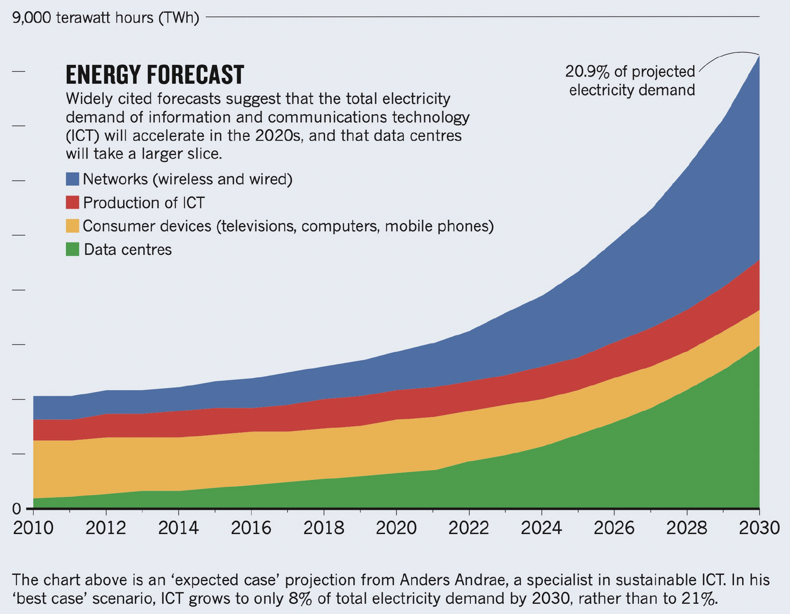
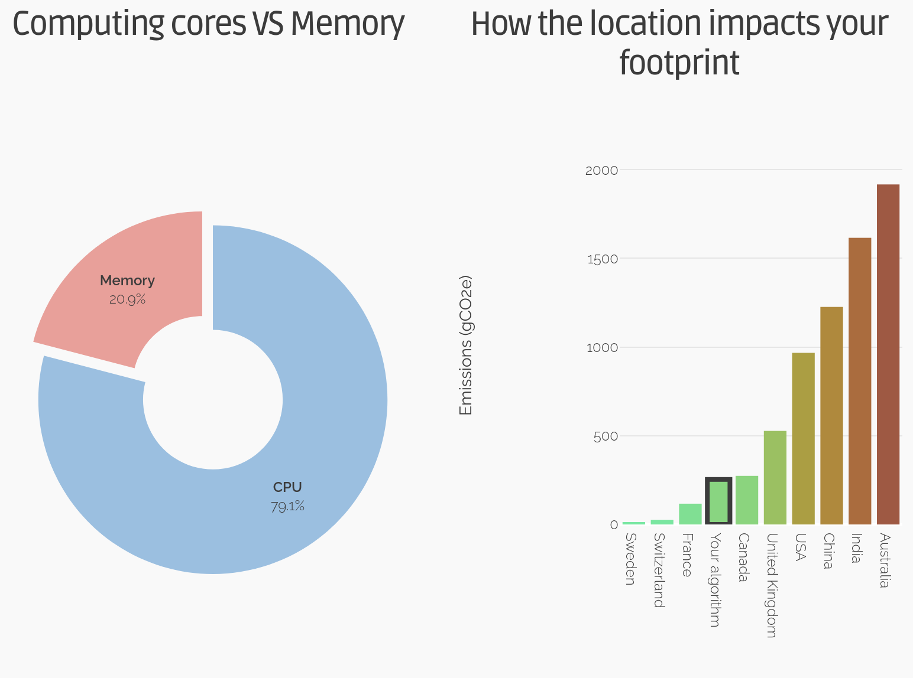

<!-- .slide: data-state="title" -->

# Energy Budget

===

<!-- .slide: data-state="standard" -->

## Growing energy use

Note:

As researchers, we are not always aware of the cost and energy
requirements (thus CO2 eq.) of the compute we use daily.

===

<!-- .slide: data-state="standard" -->

## Data centre metrics
- Power Usage Effectiveness (PUE)
- Quantifies overhead. Gives you e.g. how much cooling power you need per unit of compute
- Best data centres are now down to about 10% extra for cooling. Used to be around 100%.

Note:

===

<!-- .slide: data-state="standard" -->

## PUE of datacenter

Modern data centers only need about 10% extra power
for cooling and such on top of the compute required power.

PUE = P_{total} / P_{compute}

Note:

===

<!-- .slide: data-state="standard" -->

## Energy Carbon intensity
- Carbon intensity has a large spatial and temporal variability.
- Extreme differences between countries
- Countries with very low carbon intensity: 20g per kWh
- Countries with high carbon intensity (e.g. Australia): 700g per kWh
- You can make a big difference by running the exact same thing on the same hardware, but in a different country

Note:

===

<!-- .slide: data-state="standard" -->

# Typical footprint
- Carbon footprint of data centres anually is around 100 MT of CO2 equivalent
  - That is the same as the entire US aviation in the same time.
  - Not all these data centres are doing HPC
- About 500 Tonnes of CO2 estimated for training GPT3
  - IPC says we should aim for 2 tonnes of CO2 per person per year to keep global warming in check. 
  - Not every model has such huge impacts, but we need to be mindful

Note:

===

<!-- .slide: data-state="empty" -->

<iframe src="https://app.electricitymaps.com/map"></iframe>

===

<!-- .slide: data-state="empty" -->

# Dutch specific energy mix

[Nowtricity](https://www.nowtricity.com/country/netherlands")

===

<!-- .slide: data-state="standard" -->

## Contributions

- Computing carbon footprint can be split into two main contributions:
  - *Embodied*: from raw material extraction, to distribution
  - *Usage*: Powering, memory

Note:

===

<!-- .slide: data-state="standard" -->

## Manufacturing and amortizing
  - Production -> delivery -> usage -> recycle

Note:

===

<!-- .slide: data-state="standard" -->

## Typical values of energy

| Energy (J) | Examples | Equ. gCO2 |
| :-------- | -------: |--------:|
| 1.0e0 | ???? | |
| 1.0e1 | ???? | |
| 1.0e2 | ???? | |
| 1.0e3 (kJ) | ???? | |
| 1.0e4 | ???? | |
| 1.0e5 | ???? | |
| 1.0e6 (MJ) | ???? | |
| 3.6e6 (1 kWh)| ???? | 305 |
| 1.0e7 | ???? | |
| 1.0e8 | ???? | |
| 1.0e9 (0.27 MWh) | ???? | |

Note:

Do you have a feel for how much 1 Joule actually is?
Press down arrow to see the examples for different orders of magnitude.

==

## Typical values of energy

| Energy (J) | Examples | Equ. gCO2 |
| :-------- | -------: |--------:|
| 1.0e0 | Lift an apple to your mouth | |
| 1.0e1 |  | |
| 1.0e2 |  | |
| 1.0e3 (kJ) | Standby LED (0.3W) for 1 hour | |
| 1.0e4 | LED-based lightbulb (3W) for 1 hour | |
| 1.0e5 | 15 mn bike ride | |
| 1.0e6 (MJ) | ~ 2km drive | |
| 3.6e6 (1 kWh)|  | 305 |
| 1.0e7 | Human energy need per day | |
| 1.0e8 | Averaged daily cons. of NL home | |
| 1.0e9 (0.27 MWh) | Round trip flight AMS-LON for 2 | |

===

<!-- .slide: data-state="standard" -->

## Power consumption of computing hardware

CPU power over years: increase
GPU power over years: increase

Scaling by Flops
- Modern CPU are drawing more power, but getting more flops/W
- GPU introduce a further jump in flops/W

Example of Snellius: same amount of flops for 1/5 of the power
when using GPUs (Ben slides)

-> Using modern hardware help reduce energy consumption
-> balancing act between amortizing embodied carbon and decreased
energy efficiency (comparatively) over time

Note:

===

<!-- .slide: data-state="standard" -->

## Cluster/server energy usage

Static power draw:
 - memory
 - network card
 - CPU leakage current ~ # of cores
is not proportional to compute.
Once the server is built and in use, maximizing occupancy
increase the power efficiency as static power draw is
amortized.

Note:

===

## CPU energy usage

CPU increased clock rate to squeeze more Flops out.
Initialy amortizes the leakage current, so more
energy efficient.

As clockrate increase, power increase too but not at
a linear rate because the voltage in the circuit needs to
be increased too in order to send signal faster.
Power ~ P_0 + k * V^2 * f_c (sort of)

Note:

===

<!-- .slide: data-state="standard" -->

## What is too much energy?
- Do the potential benefits outweigh the environmental costs?
- **We should think of energy (or CO2) the same way we think of money**
  - What matters is the _cost-benefit_ ratio
  - Is €1M a lot? Not if it leads to curing a major disease
- Currently researchers are used to making the scientific case for the money they request
- They should also be able to make the case for the corresponding carbon footprint
- The energy and carbon cost can often be hidden or abstracted from the researcher's perspective

Note:

===

<!-- .slide: data-state="standard" -->

## Estimating impact
- Loïc Lannelongue started a project called Green Algorithms: 
- Made a calculator to estimate energy cost and carbon footprint of your algorithm
- Necessary for assessing how to make computing more environmentally sustainable

Note:

===

<!-- .slide: data-state="standard" -->

## The GREENER framework
- A set of principles for green computing analogous to the FAIR principles for data
- GREENER:
  - **G**overnance
  - **R**esponsibility
  - **E**stimations: Use calculators to estimate impact of the computing
  - **N**ew collaboration
  - **E**ducation: Need to include the notion that it has a carbon footprint during training of new researchers
  - **R**esearch: Still don't know a lot about computing power usage

Note:

===

<!-- .slide: data-state="standard" -->

## The online calculator

- The Green Algorithms online calculator makes it quick and easy to estimate the carbon footprint
- Can be found here: <http://calculator.green-algorithms.org/>
- There is also a Green Algorithms tool for HPC

Note:

===

<!-- .slide: data-state="empty" -->

<iframe src="http://calculator.green-algorithms.org/"></iframe>

===

<!-- .slide: data-state="standard" -->

## Yet more paperwork?

- Is this just more work for researchers when filling out grant applications?
- All applications must estimate the environmental impact of their models.
- They did this in France and researchers still applied. The Green Algorithms Calculator was required to be used for the applications. Researchers accepted it was a fair request and still continued applying.
- If a project is cheap financially, but has a large carbon cost, there should be an explicit justification why

Note:

===

<!-- .slide: data-state="keepintouch" -->

www.esciencecenter.nl

info@esciencecenter.nl

020 - 460 47 70
