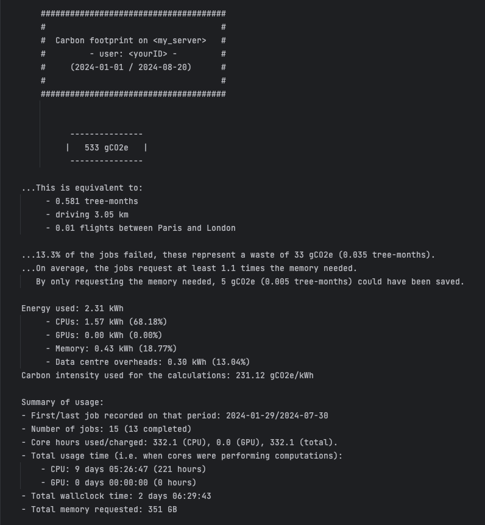
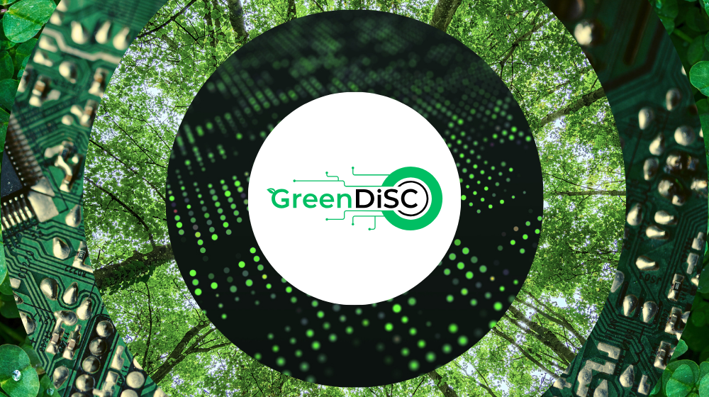

<!-- .slide: data-state="title" -->

# Carbon in Computing

===

<!-- .slide: data-state="standard" -->
### We will try to answer
- _What does this mean for carbon production?_
- _What can we do about it?_
- _Will these things help?_

===

<!-- .slide: data-state="standard" data-background-gradient="radial-gradient(rgb(230, 200, 255), rgb(255, 255, 255))" -->

### _What does this mean for carbon production?_

===

<!-- .slide: data-state="standard" -->

## Energy Carbon intensity
- Carbon intensity has a large spatial and temporal variability.
- Extreme differences between countries
- Countries with very low carbon intensity (e.g. Norway): 20g per kWh
- Countries with high carbon intensity (e.g. Australia): 700g per kWh
- You can make a big difference by running the exact same thing on the same hardware, but in a different country

Note:

So far, we've talked about energy -> a proxy for CO2 emission, using the energy carbon intensity

===

<!-- .slide: data-state="standard" -->

You can get an idea for real time carbon intensity in Europe here:

[https://app.electricitymaps.com/map](https://app.electricitymaps.com/map)

===

<!-- .slide: data-state="empty-slide" data-background-iframe="https://app.electricitymaps.com/map" -->

===

<!-- .slide: data-state="standard" -->

# Typical footprint
- Carbon footprint of data centres anually is around 100 MT of CO2 equivalent
  - That is the same as the entire US aviation in the same time.
  - Not all these data centres are doing HPC
- About 500 Tonnes of CO2 estimated for training GPT3
  - IPC says we should aim for 2 tonnes of CO2 per person per year to keep global warming in check. 
  - Not every model has such huge impacts, but we need to be mindful

Note:

===

<!-- .slide: data-state="standard" -->

# Dutch specific energy mix

[Nowtricity](https://www.nowtricity.com/country/netherlands)

===

<!-- .slide: data-state="standard" data-background-gradient="radial-gradient(rgb(230, 200, 255), rgb(255, 255, 255))" -->

### _What can we do about it?_

Note:

There are many tools and initiatives aimed at dealing with these issues

===

<!-- .slide: data-state="standard" -->

### Estimating impact
- A researcher at Cambridge, Loïc Lannelongue, started a project called Green Algorithms: 
  - Made a calculator to estimate energy cost and carbon footprint of your algorithm
  - Necessary for assessing how to make computing more environmentally sustainable

Note:

===

<!-- .slide: data-state="standard" -->

## The online calculator

- The Green Algorithms online calculator makes it quick and easy to estimate the carbon footprint
- Can be found here: <http://calculator.green-algorithms.org/>
- There is also a Green Algorithms tool for HPC

Note:

===

<!-- .slide: data-state="empty-slide" data-background-iframe="http://calculator.green-algorithms.org/" -->

===

### Green Algorithms 4 HPC

<small> <https://github.com/GreenAlgorithms/GreenAlgorithms4HPC> </small>

Note:

Green Algorithms one online calculator isn’t very practical in an HPC setting, where very many jobs are run. This tool uses the logged info about the jobs which ran on the system and estimates corresponding energy usage and carbon footprint.

Very early days, but very lightweight. Currently works with systems using SLURM but in principle is adaptable to other schedulers/workflow systems.

See <https://www.green-algorithms.org/GA4HPC/> for more.

===

<!-- .slide: data-state="standard" -->

### The Green DiSC

* Also managed by Loïc Lannelongue (Green Algorithms)
* Three levels of certification: Bronze, Silver and Gold 
* Focusses on computing (other schemes cover heating, travel etc.)
* Computing includes:
  * HPC infrastructure
  * Data storage and hardware policy
  * Eventually sustainability as part of teaching

Note:

Managed by the same person as worked on the Green Algorithms calculator.

Read in more detail here: <https://www.software.ac.uk/GreenDiSC>

===

<!-- .slide: data-state="standard" data-background-gradient="radial-gradient(rgb(230, 200, 255), rgb(255, 255, 255))" -->

### _Will these things help?_

Note:

Some practical considerations to discuss

===

<!-- .slide: data-state="standard" -->

## Yet more paperwork?

- Is this just more work for researchers when filling out grant applications?
- All applications must estimate the environmental impact of their models.
- They did this in France and researchers still applied. The Green Algorithms Calculator was required to be used for the applications. Researchers accepted it was a fair request and still continued applying.
- If a project is cheap financially, but has a large carbon cost, there should be an explicit justification why

Note:

===

<!-- .slide: data-state="standard" -->

### What is too much energy anyway?
- Do the potential benefits outweigh the environmental costs?
- **We should think of energy (or CO2) the same way we think of money**
  - What matters is the _cost-benefit_ ratio
  - Is €1M a lot? Not if it leads to curing a major disease
- Currently researchers are used to making the scientific case for the money they request
- They should also be able to make the case for the corresponding carbon footprint
- The energy and carbon cost can often be hidden or abstracted from the researcher's perspective

Note:

===

<!-- .slide: data-state="standard" -->

### Key points

- Carbon intensity has a large spatial and temporal variability
  - Carbon footprint of data centres anually is roughly the same as the entire US aviation in the same time
- Several tools and initiatives exist to help with this
  - Online calculators, carbon estimation tools, certification schemes
- Cost-benefit analysis is as important as the raw carbon cost

===

<!-- .slide: data-state="keepintouch" -->

www.esciencecenter.nl

info@esciencecenter.nl

020 - 460 47 70
