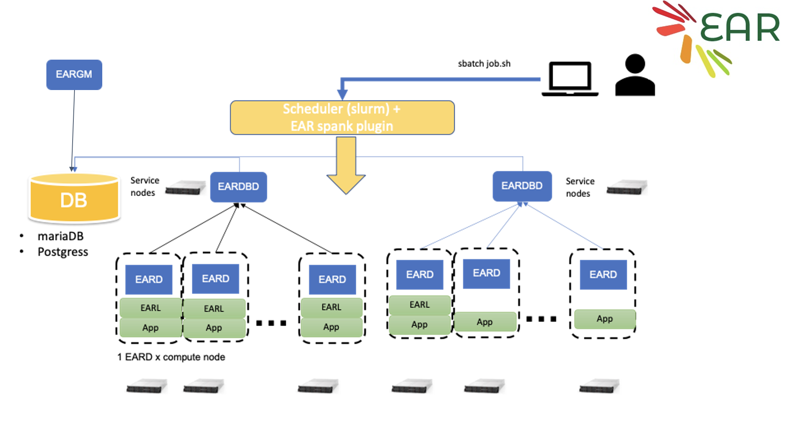

# Energy Aware Runtime (EAR) Monitoring Tutorial

>EAR documentation for use on Snellius here: https://servicedesk.surf.nl/wiki/pages/viewpage.action?pageId=62226671
>
>EAR full documentation can be found here https://gitlab.bsc.es/ear_team/ear/-/wikis/home

# Section Outline

1. [Introduction](introduction)
2. [EARL](earl)
3. [Tools](tools)
4. [Exercises](exercises)

## Introduction

The Energy Aware Runtime (EAR) package provides an energy management framework for super computers. This tutorial covers the "end-user" experience with EAR.

EAR usage on Snellius can be decomposed into two "services." 

1. The EAR library (EARL): EARL is loaded (at runtime) when launching an application through the EAR Loader (EARLO) and SLURM plugin (EARPLUG). The EARL provides functionality to monitor energy (and performance) metrics of an application and additionally the ability to select the optimal CPU frequency according to the application and the node characteristics. 

2. Tools: Which include Job accounting (via the command eacct) which queries energy information of a particular job or list of jobs from the the EAR database (EAR DB) on Snellius.

### EARD: Node Manager
The node daemon is the component in charge of providing any kind of services that requires privileged capabilities. Current version is conceived as an external process executed with root privileges.
The EARD provides the following services, each one covered by one thread:

Provides privileged metrics to EARL such as the average frequency, uncore integrated memory controller counters to compute the memory bandwidth, as well as energy metrics (DC node, DRAM and package energy).
Implements a periodic power monitoring service. This service allows EAR package to control the total energy consumed in the system.
Offers a remote API used by EARplug, EARGM and EAR commands. This API accepts requests such as get the system status, change policy settings or notify new job/end job events.
