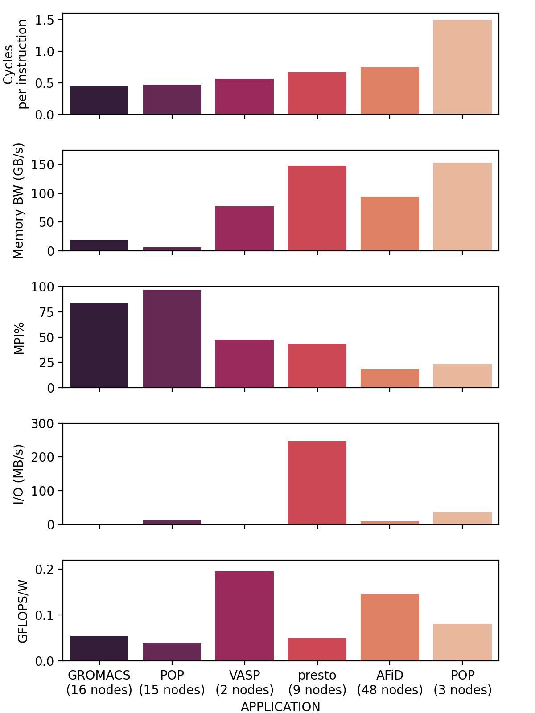

# EAR Tools

EAR is available on Snellius as a module
```
module load 2022
module load ear
```
### Job accounting (eacct)
The eacct command shows accounting information stored in the EAR DB for jobs (and step) IDs. The command uses EAR’s configuration file to determine if the user running it is privileged or not, as non-privileged users can only access their information. It provides the following options. The ear module needs to be loaded to use the eacct command.

eacct example usage
The basic usage of eacct retrieves the last 20 applications (by default) of the user executing it. The default behavior shows data from each job-step, aggregating the values from each node in said job-step. If using SLURM as a job manager, a sbatch job-step is created with the data from the entire execution. A specific job may be specified with -j option:

Default: Show the last 20 jobs (maximum) executed by the user.
```
eacct
```
Query a specific job
```
eacct -J 123456789
```
Query a specific job-step
```
eacct -J 123456789.0
```
Show metrics (averaged per job.stepid) from 3 jobs
```
eacct -j 175966,175967,175968
```

#### Important Options
 - `-l` shows the information for each node for each job instead of the global statistics for said job.
 - `-r` shows the EAR loop signatures. Users, job ids, and step ids can be specified as if were showing job information.
 - `-c` specifies the file where the output will be stored in CSV format. If the argument is "no_file" the output will be printed to STDOUT [default: off]


### Example:

```
squeue
             JOBID PARTITION     NAME     USER ST       TIME  NODES NODELIST(REASON)
           2884239      rome ear_sbat benjamic  R       2:19      1 tcn352
```

```
[benjamic@int4 EAR]$ eacct -j 2884239
    JOB-STEP USER       APPLICATION      POLICY NODES AVG/DEF/IMC(GHz) TIME(s)    POWER(W) GBS     CPI   ENERGY(J)    GFLOPS/W IO(MBs) MPI%  G-POW (T/U)   G-FREQ  G-UTIL(G/MEM)
2884239-sb   benjamic   ear_sbatch_GROMA MO     1     2.57/2.60/---    386.00     596.51   ---     ---   230253       ---      ---     ---   ---           ---     ---          
2884239-0    benjamic   ear_sbatch_GROMA MO     1     2.57/2.60/1.47   348.64     617.18   8.33    0.33  215175       0.2930   0.3     77.6  0.00/---      ---     --- 
```

### Application Characterization

EAR is not only a tool that will throttle CPU Freqs, but it also allows you to collect "traces" of your application, and characterize it. This is especially handy for large many node jobs, that often prove difficult to profile. In this way EAR is also a "light-weight" profiler for large applications.

The image below illustrates the usage of EAR to show the characteristics of a variety of multi-node CPU based applications side by side. This information can be obtained via the `monitoring` policy in EAR, and visualized with the `eacct` tool.


