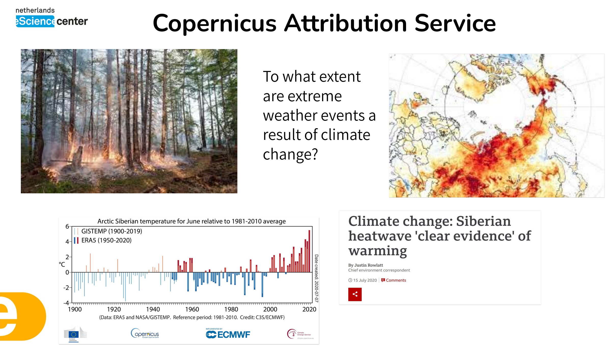

<!-- .slide: data-state="title" -->

# Green Digital Skills
### Prinses Máxima Centrum

21st November 2024

===

<!-- .slide: data-state="standard" -->

### Who we are

- Netherlands eScience Center
  - The national centre for research software
  - Collaboratively design sustainable software with researchers, and build digital skills and expertise through teaching
- SURF
  - The ICT cooperative of Dutch education and research institutions

===

<!-- .slide: data-state="standard" -->

### Before we start

- You are a diverse crowd!
- No one-size-fits-all approach to going green
- This is a broad and high-level introduction to a broad, deep area
- We want to help you find the aspect you are interested in and get you set up

Note:

We have people who maybe do data analysis, some scripting (R, Python?) but also others launching some much more complex bioinformatics workflows, and submitting jobs to HPC (either your local cluster or Snellius)

We have tried to include something for everyone here, to get you started with where to go for further expertise

For the technical aspects there are many good (but much longer) courses available that go into this in depth

We also give best practices that you might not have considered, or discussion points regarding the need for policy
We want you to get set up with the tools you might need and know where to look to pursue that further

===

<!-- .slide: data-state="standard" -->

### Schedule
| Time | |
| :--- | :--- |
| 10:30-11:00 | Walk in with tea and coffee |
| 11:00-12:00 | Lecture |
| 12:00-12:45 | Lunch |
| 12:45-13:45 | Hands-on workshop part 1 |
| 13:45-14:00 | Break |
| 14:00-14:45 | Hands-on workshop part 2 |
| 14:45-15:15 | Wrap up & drinks |

===

<!-- .slide: data-state="standard" -->

## Why do you care about "Green Computing"?

===

<!-- .slide: data-state="standard" -->

### Projects on Climate related issues

===

<!-- .slide: data-state="keepintouch" -->

www.esciencecenter.nl

info@esciencecenter.nl

020 - 460 47 70
