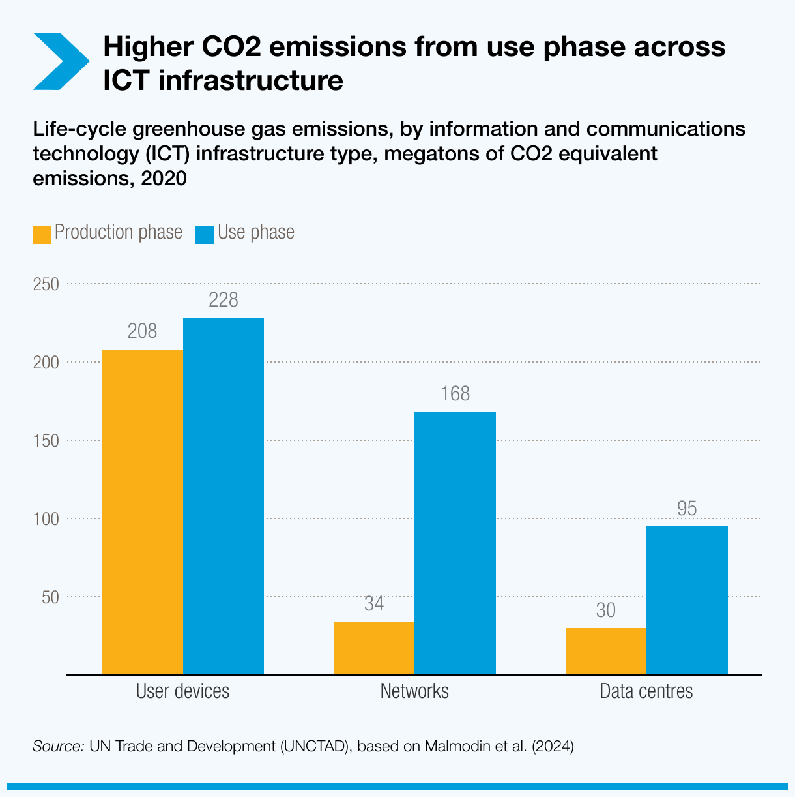

<!-- .slide: data-state="title" -->

# Optimizing Energy Use in Practice

===

<!-- .slide: data-state="standard" -->

### What we will cover here
- Does optimizing the software matter?
- What software development choices can reduce energy wastage
- How can we measure the actual energy usage of our code

===

<!-- .slide: data-state="standard" -->

## _Does optimizing the software matter?_

===

<!-- .slide: data-state="standard" -->

<div style="width: 40%; float: left; margin-top: 1%">

* Most CO2 comes from the usage of data centers not the building of them
* Reducing your energy while running software indeed matters.

</div>

<div style="width: 60%; float: right">



</div>


Note:

Here is something that adds to the story of “optimization of energy”: This CO2 footprint of use phase vs production phase shows that most of the CO2 comes from the usage of data centers not the building of them. So reducing your energy while running software indeed matters.

===


<!-- .slide: data-state="standard" -->

### Good software practice

Clean and maintainable software is essential
for sustainable/green software:
 - Ease of use, reduce error during data settings
 - Less bugs, avoid wasteful bugged runs

Note:

===

<!-- .slide: data-state="standard" -->

### Software life cycle

- Thinking about long term sustainability, documentation.
- Reusable software is a key component of modern
software development, reducing the time/energy consuming
task of developing every component of complex softwares.

Note:

===

<!-- .slide: data-state="standard" -->

### What language should I use?
- Typical conception of energy efficiency:
  - C++ and Rust at the top
  - Python and R at the bottom
- There is a lot of truth in this but there are a lot of important considerations
- **Many major numerical libraries in Python are not Python "under the surface"**
  - The core is usually C++ or something like that.
  - e.g. PyTorch, Tensorflow, numpy (and many others)

Note:

===

<!-- .slide: data-state="standard" -->

### Use the right tool for each task

- Should I avoid "slow" and inefficient programming languages?
- Well, each has its purpose
  - Python: great for stitching pieces together, easy prototyping
  - C/C++/Fortran: better at crunching numbers fast
- Language benchmarks available in the literature can be misleading here
  - Python/R for can be fine, it's more about the libraries you are using

Note:

===

<!-- .slide: data-state="standard" -->

### What software should we optimize?
- **It is important that frequently used tools are as efficient as possible**
- Your single-use analysis scripts probably don't matter so much - just use the easiest language for the job
- Optimization is not free and costs development time (and energy) especially in lower level languages like C
- Generally there are not enough RSEs to do all the coding and optimizations, and researchers don't have time

Note:

===

<!-- .slide: data-state="standard" -->

### Minimizing energy use
- Ultimately depends on the resources you use
- Number of CPU cores is clearly a large contributor
- Carbon footprint of memory is interesting - it doesn't matter how much you use, but how much is available. Don't request 10 times the memory you need on a server "just in case"
- Think about WHEN we run a job on a server. Energy mix different at different times.
- Can use tools such as the Carbon Aware Task Scheduler - tells you what is the best time to run in the next 48 hours.
- Most jobs have some flexibility - we don't care if we run it right now or in a few hours. Especially over the weekend.

Note:

===

<!-- .slide: data-state="standard" -->

### Time to solution

- Energy is Power * time
- As a first approximation, more efficient (faster) software will be energy efficient
  - It is possible to run on many CPUs although there is overhead from the parallelism.

Note:

===

### Profile your code

- We recommend trying `CodeCarbon`
  - More in this afternoon's hands-on workshop
- Also PMT (Power Measurement Toolkit), Rjoules, and many more 

Note:

===

<!-- .slide: data-state="standard" -->

### What if I can't/won't change the code?

- Perhaps you can profile the code but you cannot do much with the results
  - e.g. You are not the developer, or don't feel experienced enough
- There are tools such as the Energy Aware Runtime
  - Dynamically scales the CPU or GPU clock frequency up or down while the code is running
  - When code is waiting a lot (for I/O or memory), frequency is scaled down
  - Remember that Power ~ frequency^2
  - Also covered in this afternoon's hands-on workshop (HPC-track)

Note:

===

<!-- .slide: data-state="standard" -->

### A warning: Jevon's Paradox

```
In economics, the Jevons paradox occurs when technological progress increases
the efficiency with which a resource is used (reducing the amount necessary for any one use),
but the falling cost of use induces increases in demand enough that resource use is increased,
rather than reduced.
```

- [https://en.wikipedia.org/wiki/Jevons_paradox](https://en.wikipedia.org/wiki/Jevons_paradox)

* Are you thinking about this the right way?
* Is green computing really a purely technical issue?
* Is your footprint by computing really your biggest contribution to the climate crisis?
* Organizational policy is as important if not more important

Note:
In practice, reducing energy use overall is more about organizational policy and value judgements about what the expected return is for a given amount of energy used.

===


<!-- .slide: data-state="keepintouch" -->


www.esciencecenter.nl

info@esciencecenter.nl

020 - 460 47 70
