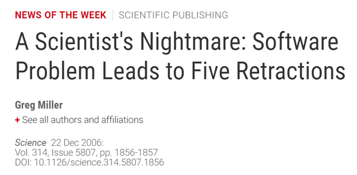

<!-- .slide: data-state="title" -->

# Optimizing Energy Use in Practice

===

<!-- .slide: data-state="standard" -->

### What we will cover here
- What development choices matter?
- What should you optimize and how do you know?
- What can you do if you can't change the code you're using?

===

<!-- .slide: data-state="standard" data-background-gradient="radial-gradient(rgb(230, 200, 255), rgb(255, 255, 255))" -->

### _What development choices matter?_

===

<!-- .slide: data-state="standard" -->

### Good software practices

<small> Find the complete articles [here](https://www.science.org/doi/full/10.1126/science.314.5807.1856), [here](https://arstechnica.com/information-technology/2019/10/chemists-discover-cross-platform-python-scripts-not-so-cross-platform/), and [here](https://www.wired.com/2010/11/1110mars-climate-observer-report/) </small>

Clean and maintainable software with a robust testing framework is essential
for sustainable/green software:
 - Ease of use, reduce error during data settings
 - Less bugs, avoid wasteful bugged runs

Note:

Poor testing and bad software practices lead not only to wrong and retracted papers, but also contribute to a lot of wasted energy...

In the long run, this is as important as measuring the energy use of your code, optimizing run time etc.

We (optionally) cover good software practices in this afternoon's hands-on workshop.

===

<!-- .slide: data-state="standard" -->

### Software life cycle

- Thinking about long term sustainability, documentation.
- Reusable software is a key component of modern
software development, reducing the time/energy consuming
task of developing every component of complex softwares.

Note:

We (optionally) cover good software practices in this afternoon's hands-on workshop.

===

<!-- .slide: data-state="standard" -->

### What language should I use?

Note:

Energy ranking of languages across many different benchmarks

Table is from Pereira, R. et al. (2021) <doi:10.1016/j.scico.2021.102609>

===

<!-- .slide: data-state="standard" -->

### What language should I use?

- Let's use C for everything!

Note:

Energy ranking of languages across many different benchmarks

Table is from Pereira, R. et al. (2021) <doi:10.1016/j.scico.2021.102609>

===

<!-- .slide: data-state="standard" -->

### What language should I use?

- Let's use C for everything!
- Please don't. Reality is more nuanced.
- **Many major numerical libraries in Python are not Python "under the surface"**
  - The core is usually C++ or similar
  - e.g. PyTorch, Tensorflow, numpy (and many others)

Note:

Typical ranking:
  - C++ and Rust at the top
  - Python and R at the bottom

===

<!-- .slide: data-state="standard" -->

### Use the right tool for each task

- Should I avoid "slow" and inefficient programming languages?
- Well, each has its purpose
  - Python: great for stitching pieces together, easy prototyping
  - C/C++/Fortran: better at crunching numbers fast
- Language benchmarks available in the literature can be misleading here
  - Python/R for can be fine, it's more about the libraries you are using

Note:

===

<!-- .slide: data-state="standard" data-background-gradient="radial-gradient(rgb(230, 200, 255), rgb(255, 255, 255))" -->

### _What should you optimize and how do you know?_

===

<!-- .slide: data-state="standard" -->

### Don't optimize everything

- **It is important that frequently used tools are as efficient as possible**
- Your single-use analysis scripts probably don't matter so much - just use the easiest language for the job
- Optimization is not free and costs development time (and energy) especially in lower level languages like C
- Generally there are not enough RSEs to do all the coding and optimizations, and researchers don't have time

Note:

===

<!-- .slide: data-state="standard" -->

### Minimize time to solution

`$$ E = Pt$$`
- Energy is Power * time
- As a first approximation, more efficient (faster) software will be energy efficient
  - It is possible to run on many CPUs although there is overhead from the parallelism.

How to do this is very problem-dependent!

Note:
Generally speaking, finish as quickly as possible so the CPU can drop to a lower energy state

How to get maximum speed out of your code (including parallelism/accelerators) is beyond the scope of this course by quite some distance.

===

### Profile your code

- We recommend trying `CodeCarbon` python package
  - Estimates the amount of carbon dioxide (CO$_2$) produced by the cloud or personal computing resources used to execute the code
  - Gives recommendations for reducing emissions (e.g. through optimizing the code or by hosting cloud infrastructure in geographical regions that use renewable energy sources)
  - *More in this afternoon's hands-on workshop*

Note:

There are many ways to do energy profiling e.g. PMT (Power Measurement Toolkit), Rjoules, and many more.

We recommend trying CodeCarbon

The code-carbon.io website decribes it as "a lightweight software package that seamlessly integrates into your Python codebase. It estimates the amount of carbon dioxide (CO$_2$) produced by the cloud or personal computing resources used to execute the code.

It then shows developers how they can lessen emissions by optimizing their code or by hosting their cloud infrastructure in geographical regions that use renewable energy sources."

This sounds like a good place to start for researchers here.

===

Note:

Screenshot from the website to illustrate functionality: <https://codecarbon.io/#howitwork>

In principle there is a dashboard showing your usage in the context of everyday values,
as well as suggestions for where to run your cloud workflows to reduce carbon cost (assuming
you have control over this).

However, getting the dashboard locally is not really possible/easy yet unfortunately.
CodeCarbon is promising and developing fast, with lots of interested parties, so
a good choice for the future.

===

<!-- .slide: data-state="standard" data-background-gradient="radial-gradient(rgb(230, 200, 255), rgb(255, 255, 255))" -->

### _What can you do if you can't change the code you're using?_

===

<!-- .slide: data-state="standard" -->

### What if I can't/won't change the code?

- Perhaps you can profile the code but you cannot do much with the results
  - e.g. You are not the developer, or don't feel experienced enough
- There are tools such as the Energy Aware Runtime
  - Dynamically scales the CPU or GPU clock frequency up or down while the code is running
  - When code is waiting a lot (for I/O or memory), frequency is scaled down
  - Remember that Energy ~ frequency^2
  - *Also covered in this afternoon's hands-on workshop (HPC-track)*

Note:

===

<!-- .slide: data-state="standard" -->

### Minimizing energy (and carbon)

- Think about _when_ we run a job on a server. Energy mix different at different times
- Interesting new tools such as Carbon Aware Task Scheduler (UK-only currently)
  - Tells you what is the best time to run in the next 48 hours
- Think about what resources you request
  - Number of CPU cores is clearly a large contributor
  - Carbon footprint of memory is interesting - it doesn't matter how much you use, but how much is available. Don't request 10 times the memory you need on a server "just in case"

Note:
Carbon awareness image is from <https://github.com/Green-Software-Foundation/carbon-aware-sdk>.

Most jobs have some flexibility - we don't care if we run it right now or in a few hours. Especially over the weekend.

===

<!-- .slide: data-state="standard" -->

### A warning: Jevon's Paradox

_In economics, the Jevons paradox occurs when technological progress increases
the efficiency with which a resource is used (reducing the amount necessary for any one use),
but the falling cost of use induces increases in demand enough that resource use is increased,
rather than reduced._

- [https://en.wikipedia.org/wiki/Jevons_paradox](https://en.wikipedia.org/wiki/Jevons_paradox)

Note:
In practice, reducing energy use overall is more about organizational policy and value judgements about what the expected return is for a given amount of energy used.

* Are you thinking about this the right way?
* Is green computing really a purely technical issue?
* Is your footprint by computing really your biggest contribution to the climate crisis?
* Organizational policy is as important if not more important

Image attribution:
Sea Cow, CC BY-SA 4.0 <https://creativecommons.org/licenses/by-sa/4.0>, via Wikimedia Commons

===

<!-- .slide: data-state="standard" -->

### Key points
  
- Don't neglect good software development practices
- The libraries you use can matter as much as language choice
- Only optimize code if it will have impact (runs a lot, uses a lot of energy)
- If you can't change the code, choose when/where to submit it or use a frequency scaling tool

===

<!-- .slide: data-state="keepintouch" -->

www.esciencecenter.nl

info@esciencecenter.nl

020 - 460 47 70
